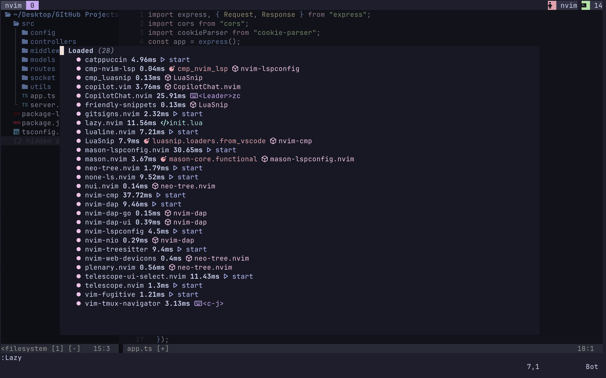
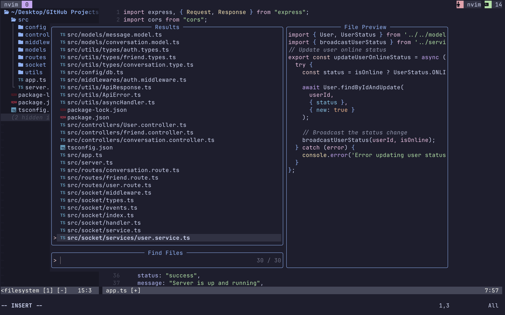
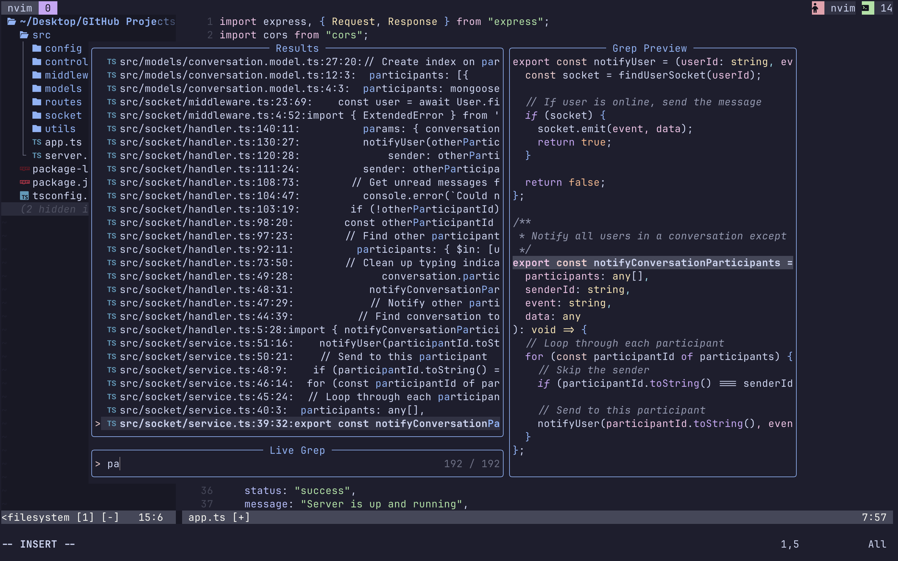
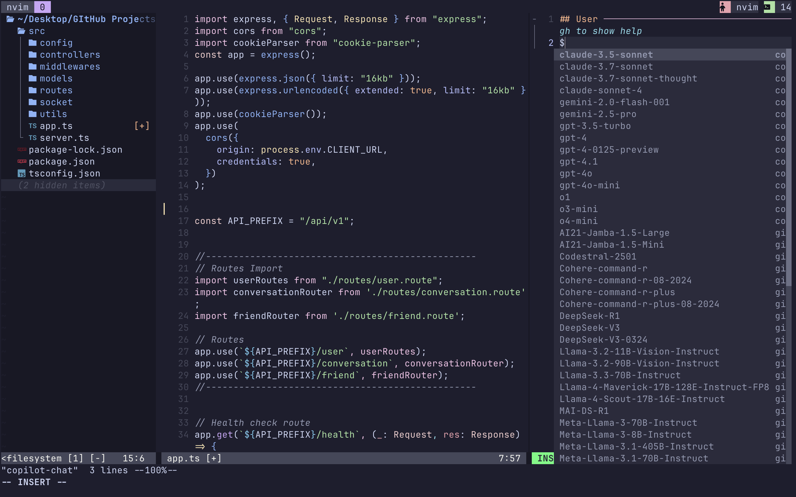
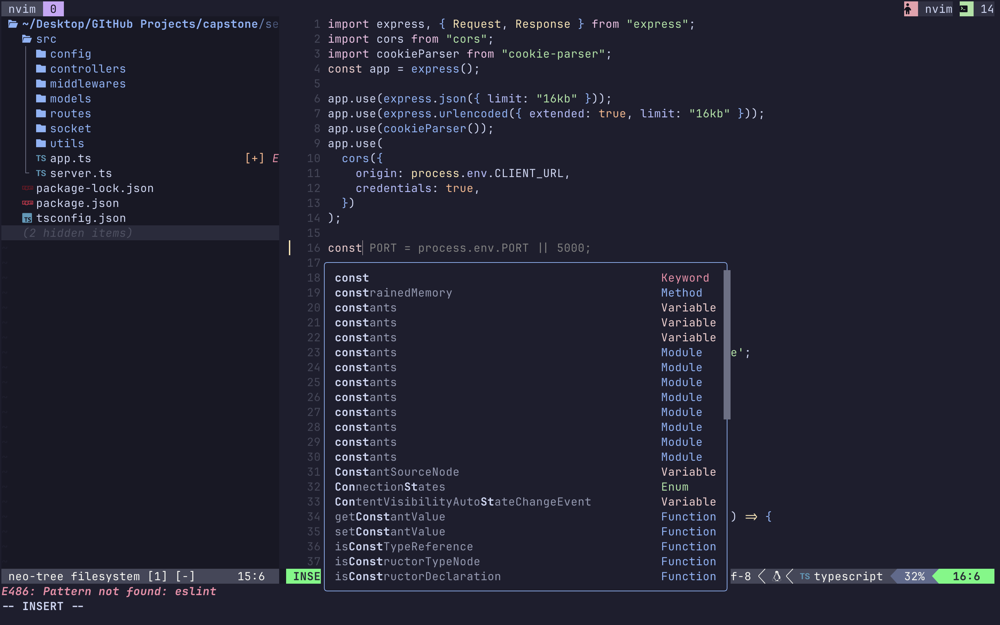

# Neovim Configuration

This is my personal Neovim configuration focused on development with a clean and functional interface.

## Screenshots

### Package Management with Lazy.nvim


### Finding Files with Telescope


### Live Grep for Searching


### GitHub Copilot Integration


### Code Display


## Key Features

- File explorer with Neo-tree
- Syntax highlighting with Treesitter
- Fuzzy finding with Telescope
- LSP integration for code intelligence
- GitHub Copilot support
- Git integration with Fugitive and Gitsigns
- Debugging support with nvim-dap
- Catppuccin color scheme

## Installation

1. Clone this repository to your Neovim config directory:
```bash
git clone https://github.com/itisrohit/nvim-config.git ~/.config/nvim
```

2. Start Neovim and the plugins will be automatically installed.

## Configuration Structure

```
~/.config/nvim/
├── init.lua              # Main entry point
├── lua/
│   ├── vim-options.lua   # Basic Neovim settings
│   ├── plugins.lua       # Plugin management
│   └── plugins/          # Individual plugin configurations
│       ├── catppuccin.lua
│       ├── completions.lua
│       ├── copilotchat.lua
│       ├── debugging.lua
│       ├── git-stuff.lua
│       ├── lsp-config.lua
│       ├── lualine.lua
│       ├── neo-tree.lua
│       ├── none-ls.lua
│       ├── nvim-tmux-navigation.lua
│       ├── telescope.lua
│       └── treesitter.lua
```

## Key Mappings

### General
- `Space` - Leader key
- `<leader>h` - Clear search highlights

### Navigation
- `<c-h>/<c-j>/<c-k>/<c-l>` - Navigate between splits/tmux panes
- `<c-n>` - Toggle Neo-tree file explorer

### Telescope
- `<C-p>` - Find files
- `<leader>fg` - Live grep (search in files)

### LSP
- `K` - Hover documentation
- `<leader>gd` - Go to definition
- `<leader>gr` - Find references
- `<leader>ca` - Code actions
- `<leader>gf` - Format document

### Git
- `<leader>gp` - Preview git hunk
- `<leader>gt` - Toggle git blame

### Debugging
- `<Leader>dt` - Toggle breakpoint
- `<Leader>dc` - Continue execution
- `<Leader>dx` - Terminate debugging
- `<Leader>do` - Step over

### GitHub Copilot Chat
- `<Leader>zc` - Chat with Copilot
- `<Leader>ze` - Explain selected code
- `<Leader>zr` - Review selected code
- `<Leader>zf` - Fix code issues
- `<Leader>zo` - Optimize code
- `<Leader>zd` - Generate documentation
- `<Leader>zt` - Generate tests
- `<Leader>zm` - Generate commit message
- `<Leader>zs` - Generate commit for selection

## Language Support

This configuration provides built-in support for:
- TypeScript/JavaScript (ts_ls)
- Lua (lua_ls)
- Rust (rust_analyzer)
- Go (gopls)

Additional language servers can be installed through Mason.

## Formatting and Linting

Using null-ls (none-ls) for:
- Lua formatting with stylua
- JavaScript/TypeScript formatting with prettier
- Ruby linting with rubocop
- ERB template linting

## Dependencies

- Neovim >= 0.8.0
- Git (for plugin installation)
- A Nerd Font for icons (recommended)
- Tmux (optional, for tmux integration)

## Customization

Edit the files in `lua/plugins/` to customize individual plugins or add new ones.
Basic Vim options can be modified in `lua/vim-options.lua`.