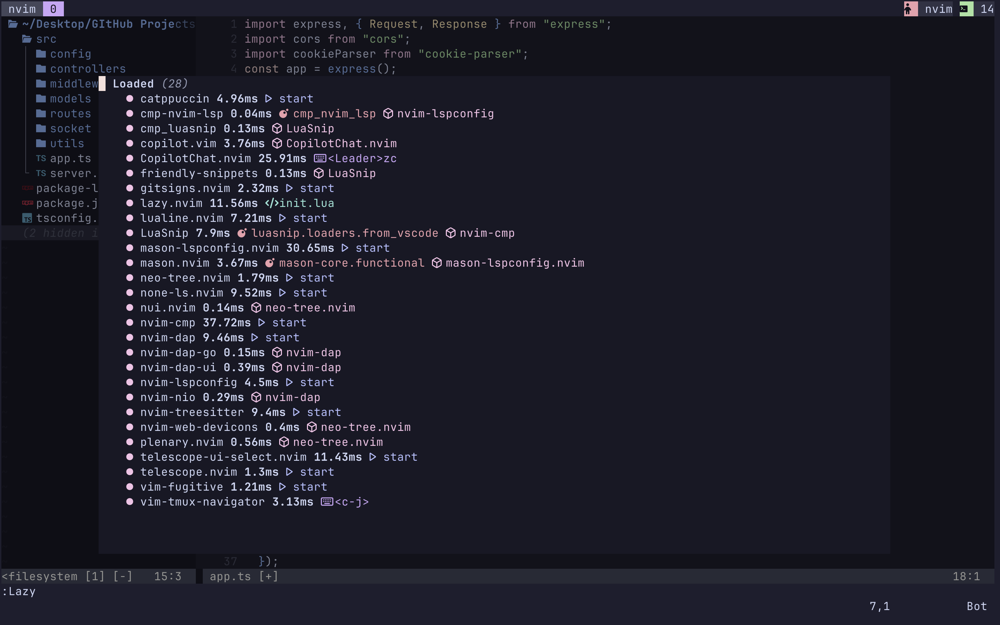
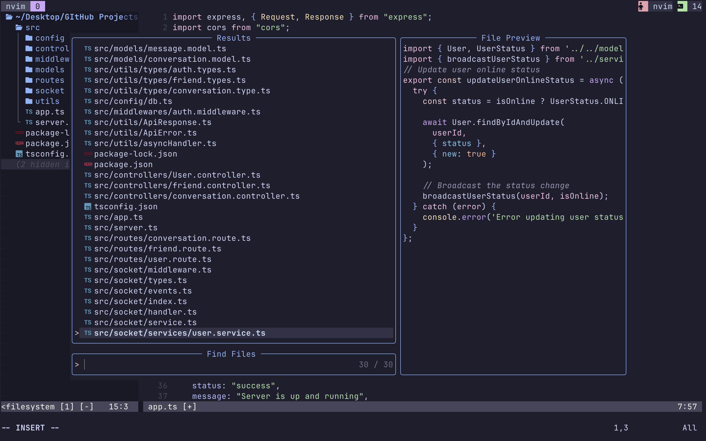
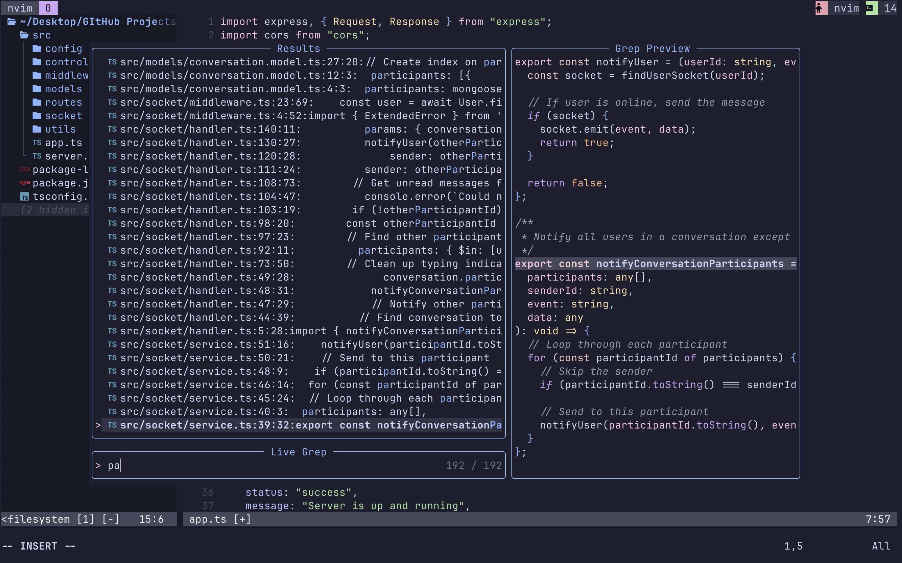
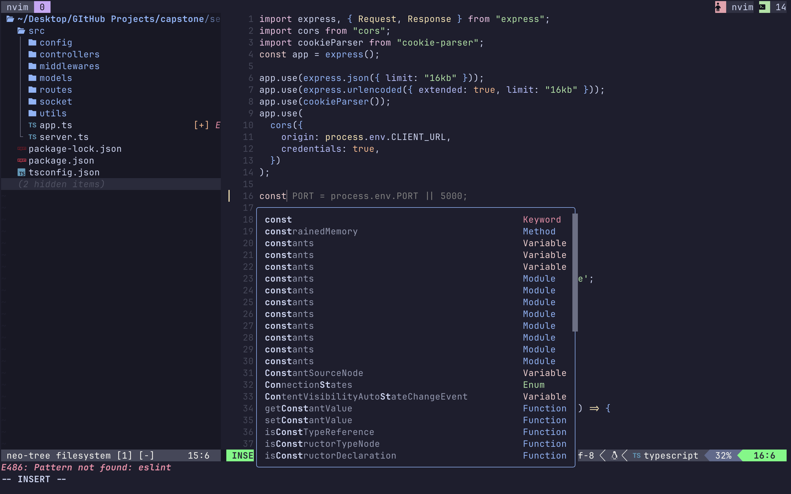

# Neovim Configuration

A simple Neovim setup for coding.

## Screenshots

### Package Management with Lazy.nvim


### Finding Files with Telescope


### Live Grep for Searching


### Code Display


## What You Get

- File explorer
- Better syntax highlighting
- Fast file search
- Code completion and LSP support
- Autosave
- Mouse support
- Persistent undo history
- GitHub Copilot inline suggestions
- Git helpers
- Debugging tools
- Catppuccin theme

## Installation

1. Clone this repo:
```bash
git clone https://github.com/itisrohit/nvim.git ~/.config/nvim
```

2. Open Neovim:
```bash
nvim
```

3. Let the plugins install.

## Main Shortcuts

- `Space e` opens or closes the file sidebar
- `Space f f` finds files
- `Space f s` searches text across files
- `Space z` undoes the last change
- `Space Shift-z` redoes the last undone change
- `Space y` copies to system clipboard
- `Space p` pastes from system clipboard
- `K` shows help for the thing under your cursor
- `Space d` jumps to definition
- `Space r` shows references
- `Space a` shows code actions
- `Space g f` formats the current file
- `Space g p` previews the current git change
- `Space b` toggles git blame

## Neo-tree

- Open the sidebar with `Space e`
- The sidebar refreshes automatically when files change
- `a` creates a new file
- `A` creates a new folder
- `r` renames
- `d` deletes
- `Enter` opens a file
- `q` closes the sidebar

## Editing Behavior

- Files autosave while you work
- Mouse click and scroll are enabled
- Undo history is saved between sessions

## Copilot

- Open a file and go into Insert mode to get suggestions
- `Tab` accepts the suggestion
- `Ctrl-]` dismisses the suggestion

## Language Support

Built-in support includes:
- TypeScript/JavaScript (ts_ls)
- Lua (lua_ls)
- Rust (rust_analyzer)
- Go (gopls)

You can add more language servers later through Mason.

## Formatting and Linting

Formatting and linting currently use:
- Lua formatting with stylua
- JavaScript/TypeScript formatting with prettier
- Ruby linting with rubocop
- ERB template linting

## Dependencies

- Neovim >= 0.8.0
- Git (for plugin installation)
- A Nerd Font for icons (recommended)
- Tmux (optional, for tmux integration)

## Editing The Config

- Change plugin settings in `lua/plugins/`
- Change basic Neovim options in `lua/vim-options.lua`
